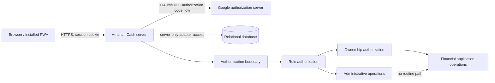
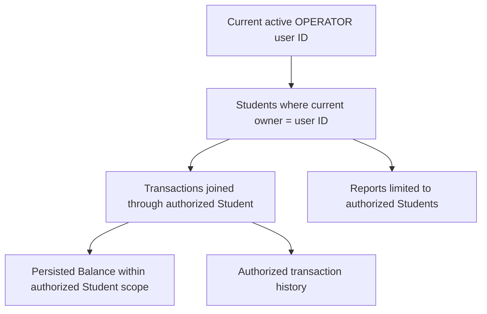
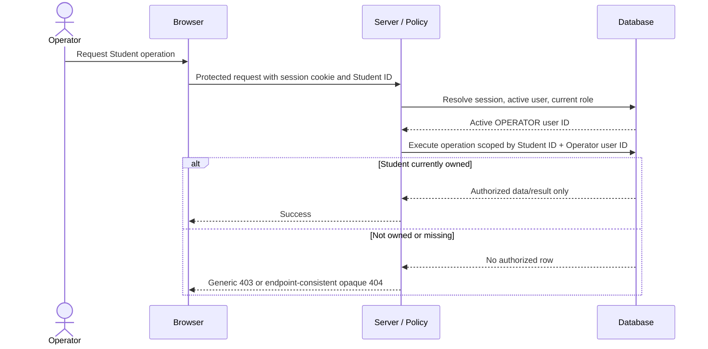

# Technical Design Specification — Authentication and Authorization

**Status:** Implementation contract, pending the approval gates in Section 17  
**Date:** 2026-07-20  
**Owners:** Solution Architecture, Security, and Engineering  
**Applies to:** Amanah Cash authentication, session management, role authorization, Student ownership, and administrative account lifecycle

## 1. Purpose, Scope, and Authority

This specification translates the following accepted decisions into an implementation contract:

- [ADR-001 — Authentication with Auth.js and Google](26-adr-authentication.md)
- [ADR-002 — Amanah Cash Authorization and Roles](27-adr-authorization-and-roles.md)
- [ADR-003 — Financial Data Privacy and Administrative Separation](28-adr-financial-data-privacy.md)

The decisions are not reopened here. Authentication uses Auth.js, Google only, and database sessions. Amanah Cash has exactly two current roles, `PLATFORM_ADMIN` and `OPERATOR`. Every Student belongs to exactly one Operator. Authorization is enforced on the server. A Platform Admin manages the platform but has no routine access to Operator financial data.

This document specifies behavior and contracts; it does not approve or provide application code, a physical schema, migrations, UI, production hosting, or secrets. The terms `PlatformUser`, `ProviderAccount`, and `DatabaseSession` below are logical responsibilities. Their physical table and column names remain subject to the database-design review required by ADR-002.

### 1.1 Normative language

`MUST`, `MUST NOT`, `SHOULD`, and `MAY` are normative. “Protected request” means any server-rendered request, server action, route handler, or API operation that is not explicitly public.

### 1.2 Core invariants

1. Google establishes identity; Amanah Cash establishes admission, active status, role, and ownership.
2. Login is allowed only for an active, pre-provisioned PlatformUser whose normalized email exactly matches the verified Google email.
3. A session token is only a lookup key. Current user status and role are resolved server-side for every protected request.
4. Operator financial access is always scoped through the Student's current Operator ownership.
5. `PLATFORM_ADMIN` is not a financial superuser. There is no role bypass, support bypass, or hidden all-data route.
6. A missing, invalid, stale, or ambiguous authorization fact fails closed.
7. Financial values and provider credentials never enter the application session payload, client-readable state, logs, analytics, or administrative responses.

## 2. Component and Trust-Boundary Design



Trust boundaries are:

- The browser is untrusted. Route parameters, form data, headers, hidden fields, cached pages, and role claims from the client are input only.
- Google is trusted only for the authenticated Google subject, verified email, and provider protocol result. Google profile data does not grant a role or Student access.
- Auth.js owns OAuth/OIDC state, callback correlation, CSRF defenses, provider-token handling, and session-cookie mechanics.
- The Amanah Cash server is the authorization policy-enforcement point.
- The database is authoritative for provisioned users, active status, current role, sessions, provider linkage, and current Student ownership.
- Direct operational database access, backups, and observability systems are privileged infrastructure boundaries governed by separate production procedures.

The server separates these logical services:

| Service | Responsibility | Must not do |
|---|---|---|
| Authentication adapter | Configure Auth.js, Google, callbacks, and database sessions | Assign roles from Google claims |
| Admission service | Normalize email and match one active provisioned user | Create public users or reveal account existence |
| Session resolver | Resolve token to session and current PlatformUser | Place financial data in session context |
| Authorization policy | Validate role and ownership | Trust a client-supplied role or owner ID |
| Admin service | Provision/deactivate users; assign/transfer Students | Read balances, Transactions, history, or reports |
| Operator service | Execute ownership-scoped Student and financial operations | Issue an unscoped Student/Transaction query |
| Security/admin audit service | Record authentication, security, and administrative events | Record tokens, provider credentials, financial values, or unnecessary Student identity |

ADR-004 defines a separate ownership-scoped FinancialAuditEvent service that necessarily records allowlisted financial before/after evidence. It must not reuse security logs, enter authentication/session payloads, or become visible through Platform Admin financial access.

## 3. Authentication Flow

### 3.1 Primary flow

```mermaid
flowchart TD
    L[Landing /] --> LI[Login /login]
    LI -->|Continue with Google| G[Google OAuth]
    G -->|authorization code| C[Auth.js callback]
    C --> P{Valid provider response?}
    P -->|No| E1[Safe authentication error]
    P -->|Yes| U{Verified email matches one active provisioned user?}
    U -->|No| E2[Access denied; no authorized session]
    U -->|Yes| A[Create/update provider linkage if required]
    A --> S[Create database session and secure cookie]
    S --> Z{Current role valid?}
    Z -->|No| X[Revoke session; deny]
    Z -->|PLATFORM_ADMIN| AD[/admin]
    Z -->|OPERATOR| OP[/operator]
```

The complete success path is:

1. `GET /` returns the public Landing Page. It may link to `/login` but performs no protected data query.
2. `GET /login` checks for a valid current session. With none, it renders only the Google sign-in action. With one, it redirects through `/app` to the role home.
3. The sign-in action invokes the Auth.js Google provider flow. No application endpoint constructs a provider callback manually.
4. Google authenticates the person and returns an authorization code to the configured, exact callback URI.
5. Auth.js validates state/correlation, exchanges the code server-to-server, validates the provider response, and exposes the Google subject and verified email to the admission callback.
6. Admission requires a non-empty Google email with `email_verified = true`. The email is normalized by trimming surrounding whitespace and applying locale-independent lowercase. No alias rewriting, dot removal, or `+tag` removal is allowed.
7. The server performs an exact unique lookup on the normalized provisioned email. Exactly one active PlatformUser must match. The database must enforce normalized-email uniqueness.
8. If provider linkage is absent, it is linked to that pre-provisioned user as described in Section 4. If it exists, both provider name and immutable Google subject must resolve to the same PlatformUser.
9. Auth.js creates a random, opaque database session and sets only its session token in the protected cookie.
10. `/app` resolves the new session, confirms current active status and a recognized current role, and redirects to `/admin` or `/operator`.

### 3.2 Failure paths

| Failure | Server behavior | Browser behavior |
|---|---|---|
| User cancels at Google | Do not create session; record sanitized cancellation | Return to `/login` with a retryable generic message |
| Google/provider unavailable | Do not create session | `/login` shows temporary-unavailability message and retry action |
| Invalid/missing state, code, nonce, or callback data | Reject callback; do not link account or create session | Generic invalid-login message; never echo callback data |
| Email missing or unverified | Reject admission | Same generic unregistered/ineligible message |
| No provisioned email match | Reject admission and remove any partial session/linkage created during the attempt | Bahasa Indonesia denied message equivalent to `Akun Anda belum terdaftar. Silakan hubungi Administrator Platform.` |
| Provisioned account inactive/revoked | Reject admission and revoke its sessions | Same denied message; do not distinguish deactivated from unknown publicly |
| Duplicate normalized user match | Treat as integrity/security error; create nothing | Generic system error; alert operators through sanitized telemetry |
| Existing provider subject belongs to another user | Reject as account-link conflict; create nothing | Generic access-denied message; security event logged |
| Invalid/missing role | Create no usable session, or immediately revoke a just-created session | Generic access-denied message |
| Database unavailable | Fail closed before session creation | Temporary system-unavailable message; retry is safe |
| Unsafe requested return URL | Ignore it | Redirect only to the same-origin role home |

Login errors must not disclose whether a particular third-party email is provisioned, inactive, or linked. The friendly “not registered” text is the single public admission-denial state.

## 4. First Login and Provider-Linkage Flow

“Create Profile” means creating the Auth.js provider-linkage/profile data required by the reviewed adapter. It does **not** mean creating a PlatformUser, choosing a role, registering publicly, or overwriting administrator-managed full name/email/role.

```mermaid
flowchart TD
    R[Registered active Operator] --> G[Google login]
    G --> V{Verified Google email present?}
    V -->|No| D[Deny]
    V -->|Yes| Q[Lookup normalized provisioned email]
    Q --> E{Exactly one active PlatformUser?}
    E -->|No| D
    E -->|Yes| L{Google provider linkage exists?}
    L -->|No| N[Atomically create linkage/profile for existing user]
    L -->|Yes, same user and subject| K[Use existing linkage]
    L -->|Conflict| D
    N --> S[Start database session]
    K --> S
    S --> O[/operator]
```

### 4.1 Atomic first-login contract

The admission lookup, uniqueness checks, provider-link creation, and session creation MUST behave atomically from the user's perspective. A failed attempt leaves no authorized session and no linkage to an unprovisioned user. Concurrent first logins for the same Google account may race; database uniqueness on `(provider, providerSubject)` and normalized email must ensure one linkage. The losing request reloads the committed linkage and proceeds only if it points to the same PlatformUser; otherwise it denies.

### 4.2 Edge cases

- **Provisioned email differs only by case or outer whitespace:** it matches after the specified normalization.
- **Gmail aliases or plus addressing:** no canonicalization is performed. Admin and Google email must match after trim/lowercase only.
- **Admin changes a provisioned email before first login:** only the new normalized email admits login.
- **Admin changes email after linkage:** subsequent login must satisfy both controls: the provider subject must remain linked to the same user and the verified current Google email must match the user's current provisioned email. A mismatch denies and requires an audited admin recovery process; it is never silently relinked.
- **Google subject changes or a different Google account presents the same email:** deny; immutable provider subject continuity is required after linkage.
- **Google profile name/photo changes:** optional display metadata may be refreshed only if separately approved; it never overwrites the provisioned full name or affects authorization.
- **User is deactivated between admission lookup and session commit:** the active check is repeated in the transaction immediately before session creation; creation fails closed.
- **User is deactivated immediately after session creation:** every protected request rechecks active status; the session is rejected and deleted at the next request. Deactivation also proactively deletes all that user's sessions in the same administrative transaction.
- **Role changes during login:** the session stores no authoritative role snapshot. The next request uses the current database role.
- **Database/link write fails:** roll back the entire first-login operation; retry must not create duplicates.
- **Existing orphan adapter record:** deny, record a high-severity integrity event, and require operator repair; never guess a target user.
- **Registered Platform Admin first login:** the same linkage rules apply, then `/app` routes to `/admin`.

## 5. Platform Admin Bootstrap

### 5.1 Strategy

`SUPER_ADMIN_EMAIL` is a deployment-only bootstrap input naming the first Platform Admin's Google email. “SUPER_ADMIN” is bootstrap terminology only; it does not create a third role or a permanent superior privilege. The resulting user has exactly `PLATFORM_ADMIN`.

Bootstrap is an explicit, one-shot administrative operation executed against the target database before public login is enabled. It MUST NOT run implicitly on every application startup or within the Google sign-in callback. Required inputs are:

- `SUPER_ADMIN_EMAIL`: trimmed/lowercased using the same normalization contract;
- an explicitly supplied provisioned full name;
- target environment/database identity; and
- an operator-confirmed execution mode.

The operation validates syntax, refuses a blank or placeholder email, and performs a transaction with these rules:

1. If no PlatformUser has the normalized email, create one active `PLATFORM_ADMIN`.
2. If exactly one matching active `PLATFORM_ADMIN` exists, return success without modifying it (idempotent duplicate prevention).
3. If the email exists with `OPERATOR`, inactive status, conflicting identity data, or duplicate rows, stop without mutation and require reviewed recovery.
4. Never modify provider linkage and never create a session. The person must still complete Google authentication.

The operation emits a sanitized audit event and a non-secret completion identifier. It never prints the full email in shared CI logs; use a one-way keyed identifier or masked email.

### 5.2 First and production deployment

For the first deployment:

1. Apply the separately approved identity/session/ownership migration.
2. Back up and verify the target database.
3. Inject `SUPER_ADMIN_EMAIL` and full name from the deployment secret/configuration system for the bootstrap job only.
4. Run the bootstrap job once under dual review.
5. Verify one active `PLATFORM_ADMIN` exists using a privacy-safe check.
6. Remove `SUPER_ADMIN_EMAIL` from the running application configuration and deployment job inputs.
7. Enable Google login and perform an audited smoke test with that exact Google account.

Production MUST NOT have a hard-coded default email, seed account, development bypass, startup auto-seed, or ability to set `SUPER_ADMIN_EMAIL` from an HTTP request. The bootstrap job must have short-lived database credentials and must not be callable by the application runtime identity.

### 5.3 Local development

Local development uses an explicit idempotent seed against a disposable local database. The committed environment template uses reserved example-domain identities for local-only authentication; a developer replaces them with real Google test-account emails when exercising OAuth. The authentication substitute is rejected whenever `NODE_ENV=production`, while production bootstrap continues to require separately supplied, reviewed identities and never consumes the development seed.

### 5.4 Recovery

Loss of all usable Platform Admin accounts is recovered with an explicit break-glass runbook, not Google login auto-promotion:

1. Confirm incident authority and identify the target database/environment.
2. Take and verify a database backup.
3. Use a separately privileged recovery operation to create a new active `PLATFORM_ADMIN` or reactivate/repair an approved existing one.
4. Require two-person approval in production and record incident/ticket ID, actor, time, target user ID, reason, and outcome.
5. Revoke obsolete or suspected sessions and provider linkages as applicable.
6. Validate login, remove temporary credentials/configuration, and review audit evidence.

Recovery never grants financial visibility. Direct manual SQL is a last resort governed by the same approval and audit requirements. At least two active Platform Admin accounts are recommended after initial bootstrap to reduce lockout risk, created through the normal audited admin operation.

## 6. Session Design

### 6.1 Database-session contract

Auth.js uses the database session strategy. Each session has an opaque, cryptographically random token, a PlatformUser association, an expiry time, and adapter-required metadata. The browser cookie contains only the token and cookie attributes—never user role, email, ownership, provider tokens, or financial data. At rest, the session token SHOULD be stored as a one-way digest if the selected reviewed adapter supports lookup and deletion semantics without weakening compatibility; otherwise database access controls treat raw session tokens as credentials.

Cookie requirements:

- `HttpOnly` always;
- `Secure` in production;
- explicit `SameSite=Lax`, unless the reviewed Auth.js/provider flow requires a stricter compatible setting;
- `Path=/`;
- no broad `Domain` attribute (host-only);
- Auth.js secure cookie naming in production; and
- persistent expiry matching the database session expiry.

### 6.2 Lifetime and renewal

| Setting | Contract |
|---|---|
| Session maximum age | 8 hours since last eligible renewal |
| Renewal throttle (`updateAge`) | At most once every 15 minutes per active session |
| Renewal | On a valid protected request after the throttle, extend database and cookie expiry to request time + 8 hours |
| Inactivity | A session with no eligible request for 8 hours expires |
| Clock | Server/database UTC; tolerate no client-clock authority |

Renewal occurs only after the session token resolves, the user is active, and the role is valid. A denied request, public-page view, background service-worker event, invalid token, inactive user, or database error must not renew. This design intentionally has no separate fixed absolute lifetime; active sessions can continue, while each device can be revoked independently. A future absolute lifetime would require a reviewed session-created-at contract.

### 6.3 Lifecycle behavior

- **Login:** rotate away any pre-authentication identifier; create a fresh token only after admission succeeds. Never reuse a token supplied before login.
- **Logout:** accept only an Auth.js-protected same-origin POST. Delete the database session first, expire the cookie, apply `Cache-Control: no-store`, then redirect to `/`. Repeated logout is idempotent.
- **Multiple devices:** allowed. Each browser/device receives an independent session. A new login does not invalidate other sessions.
- **Browser restart:** the persistent cookie keeps the session until expiry/revocation. Closing the browser is not logout.
- **Inactive session:** after 8 hours without renewal, delete it lazily when presented and deny it. A scheduled cleanup MAY remove expired rows but is not an authorization control.
- **Revocation:** logout deletes one session. Deactivation, account-security recovery, or “revoke all sessions” deletes every session for the PlatformUser transactionally. Revocation takes effect on the next request and must not depend on cookie deletion succeeding.
- **Role change:** existing sessions remain tokens but immediately use the current role. A role change SHOULD revoke all sessions to force a clean role landing and reduce stale UI; correctness still relies on per-request database resolution.
- **Transfer:** does not require session revocation because ownership is resolved per operation, not stored in the session.
- **Database unavailable:** the session cannot be validated and access fails closed; an old cookie is not proof of access.
- **Caching:** protected responses and authentication error pages containing user-specific state use `Cache-Control: no-store`; service worker and shared caches must not cache them.

## 7. Route Protection

Route protection has two stages: a lightweight request gate may redirect obvious unauthenticated page requests, but every page loader, server action, route handler, and application service performs authoritative server-side session and authorization checks. Request middleware alone is insufficient.

| Route | Anonymous | Active `OPERATOR` | Active `PLATFORM_ADMIN` | Failure behavior |
|---|---|---|---|---|
| `/` | Allow | Allow | Allow | Public; no protected query |
| `/login` | Allow | Redirect via `/app` to `/operator` | Redirect via `/app` to `/admin` | Auth errors remain on `/login` |
| `/app` | Redirect to `/login` | Redirect to `/operator` | Redirect to `/admin` | Invalid/inactive session is revoked, then `/login` |
| `/operator` and descendants | Redirect to `/login` | Allow | Deny | Authenticated wrong role gets generic 403; no admin bypass |
| `/admin` and descendants | Redirect to `/login` | Deny | Allow administrative capabilities only | Authenticated wrong role gets generic 403 |
| `/api/auth/*` | Auth.js protocol rules | Auth.js protocol rules | Auth.js protocol rules | Auth.js-safe protocol response; exact callback allowlist |
| Public `/api/*` | None by default | None by default | None by default | Any exception must be explicitly enumerated and contain no protected state |
| Protected `/api/operator/*` | JSON 401 | Ownership-scoped | JSON 403 | Never redirect API clients to HTML |
| Protected `/api/admin/*` | JSON 401 | JSON 403 | Administrative operation only | Must not expose financial data |
| Any other `/api/*` | Deny by default | Deny unless policy registered | Deny unless policy registered | JSON 401 or 403 as applicable |

Redirects preserve only a validated same-origin relative destination. `/login`, Auth.js endpoints, and role-forbidden destinations are not accepted as post-login return targets. Default post-login routing is role-based. Redirect responses and protected pages are non-cacheable.

`/admin` and `/operator` are canonical role homes. `/app` is only the protected dispatcher and contains no data-fetching dashboard of its own. A Platform Admin cannot reach `/operator` merely by knowing its URL, and an Operator cannot reach `/admin`.

## 8. Authorization Layer

### 8.1 Request authorization context

Every protected operation constructs an internal authorization context from authoritative server data:

| Field | Source |
|---|---|
| Session identity and expiry | DatabaseSession selected by presented opaque token |
| User ID, active status, current role | Current PlatformUser row joined/resolved server-side |
| Request correlation ID | Server-generated |

The context contains no financial data and is not accepted from a client or serialized into a client-readable cookie. A missing session, expired session, missing user, inactive user, or invalid role produces no context.

### 8.2 Policy order

For every operation:

1. Authenticate the database session.
2. Confirm the PlatformUser exists and is active.
3. Validate the current role against the closed set `PLATFORM_ADMIN | OPERATOR`.
4. Validate the capability/route for that role.
5. For Operator Student/Transaction/report operations, resolve current Student ownership in the authoritative query or transaction.
6. Revalidate relevant invariants inside the write transaction before commit.
7. Return only fields authorized for that operation.

Role validation and ownership validation are separate. Passing one never implies the other.

### 8.3 Enforcement locations

- Presentation code may hide controls for usability but does not enforce access.
- Route handlers/server actions call application use cases with the server-built authorization context.
- Application use cases require a named capability and reject calls without context.
- Persistence exposes ownership-scoped Operator queries and dedicated Admin queries. It must not expose a reusable unscoped Student/Transaction repository method to Operator use cases.
- Write transactions repeat ownership validation using the current database state in the same transaction as the protected mutation.
- Reports resolve the authorized Student set first and aggregate only within that scope. There is no platform-wide financial report.

### 8.4 Unauthorized and forbidden behavior

- **401 Unauthorized:** no usable authenticated context. Page requests redirect to `/login`; APIs return a generic JSON 401 with a stable error code and correlation ID.
- **403 Forbidden:** a valid active user lacks the required role/capability or current ownership. Page and API responses are generic, contain no target data, and use `Cache-Control: no-store`.
- **Object enumeration:** ownership-protected object endpoints MAY map a 403 policy result to an externally indistinguishable 404 when revealing existence would expose another Operator's data. This mapping must be consistent for owned/nonexistent IDs; the audit record retains the internal authorization-failure classification. The selected mapping must be documented per endpoint during API design.
- Browser Back, stale client state, manipulated IDs, and hidden controls never restore access.

## 9. Ownership Resolution and Propagation



The current Student-to-Operator association is the sole financial ownership authority. It propagates as follows:

- Student list/search: filter by `Student.operatorId = authorizationContext.userId` in the database query.
- Student detail: select by both Student ID and current Operator ID.
- Transaction history and Balance: reach Transactions only through a Student selected by both IDs; never select Transactions by transaction/student ID and filter afterward.
- Transaction creation: inside the financial write transaction, select/lock the Student under the current Operator ID, validate Balance and input, then append the Transaction.
- Reports: start from the set of Students currently owned by the Operator, then derive only their data.
- Counts, search suggestions, exports if ever approved, error details, and pagination cursors follow the same scope and must not reveal cross-owner existence.

Ownership is not copied into the session, client state, Transaction record, or report cache. A Student transfer changes the current authorization edge only; it does not edit, duplicate, delete, or reattribute Transaction rows or Balance. ADR-004 additionally requires a privacy-minimized ownership-transfer audit event.

### 9.1 Transfer contract

A Student transfer is a dedicated `PLATFORM_ADMIN` administrative operation. The Admin may select identifiers and ownership metadata needed to perform the transfer but receives no Balance, amount, Transaction history, or financial report.

The transfer transaction must:

1. Validate an active Platform Admin and transfer capability.
2. Validate the Student exists without loading financial fields.
3. Validate the source and destination Operators exist, are distinct, and the destination is active.
4. Lock/serialize the Student ownership row using the database's approved concurrency mechanism.
5. Compare the expected current owner supplied by the admin workflow with the actual current owner; reject stale requests as conflict.
6. Replace ownership atomically.
7. Record a privacy-safe audit event with Student ID, old/new Operator IDs, actor ID, reason/ticket if required, and outcome.
8. Commit without changing any Transaction.

Financial writes and ownership transfer for the same Student must serialize. A financial write rechecks ownership inside its transaction. The ordering determines the valid result: if the write commits first, it was authorized under the old owner; if transfer commits first, the old owner's write is denied. No request may pass an early ownership check and commit after a conflicting transfer without revalidation.

After transfer, the old Operator's next query returns no Student or financial data; the new Operator can access the complete retained Transaction/audit history and persisted Balance. Previously rendered client data must be cleared on authorization failure and protected responses must not be cached.

## 10. Security Considerations

### 10.1 OAuth/OIDC security

- Use Auth.js's reviewed Google provider and authorization-code flow; do not implement protocol handling manually.
- Register exact HTTPS production callback URIs. Wildcards and untrusted preview domains are prohibited.
- Keep client secret, Auth.js secret, provider tokens, and adapter credentials server-only and in the deployment secret store.
- Require and validate OAuth state/correlation and Auth.js-supported nonce/PKCE controls where applicable.
- Request the minimum Google scopes needed for identity: `openid`, `email`, and `profile`. Do not request mail, contacts, Drive, or offline access.
- Require verified email and retain immutable Google subject linkage. Email alone is only the first-admission match, not the continuing provider identity.
- Redirect only to allowlisted same-origin relative paths.
- Pin exact Auth.js/adapter versions after security and compatibility review; apply security updates through the normal reviewed dependency process.

### 10.2 CSRF and replay

- Auth.js owns CSRF protections for sign-in and sign-out. State-changing application operations use same-origin POST/PUT/PATCH/DELETE semantics and the framework's reviewed CSRF/origin protection.
- Reject state-changing GET requests, cross-origin origins, and missing/invalid anti-CSRF evidence.
- OAuth authorization codes are single use; state/correlation values are short-lived and single-flow.
- Transaction retry identifiers prevent financial duplicate writes but are not authorization credentials.
- Student transfers use an expected-current-owner/concurrency value so stale administrative replays become conflicts rather than repeated mutations.

### 10.3 Session fixation and hijacking

- Issue a fresh random token only after admission; rotate identifiers across authentication.
- Use the cookie controls in Section 6, HTTPS/HSTS in production, `no-store` responses, and no tokens in URLs.
- Never log or expose session tokens. Protect database/backup access because session rows are credentials.
- Revoke all sessions on deactivation or suspected compromise. Account-link conflicts trigger a security event and no session.
- Do not bind sessions rigidly to IP address or user-agent; those are optional risk signals only and must not lock out legitimate mobile users.

### 10.4 Least privilege and sensitive data

- The runtime database identity receives only operations required by the application. Bootstrap/recovery credentials are separate and short-lived.
- Admin services expose identity/assignment fields only. Financial repositories are not dependencies of Admin use cases.
- Provider access/refresh tokens, if adapter-required, are encrypted or otherwise protected at rest according to the deployment security design and are never returned to the application client.
- Responses use field allowlists. Errors, analytics, tracing, and logs are scrubbed before leaving the server trust boundary.
- Content Security Policy, frame protections, MIME protections, referrer policy, and HTTPS/HSTS are required production controls, specified with deployment security headers.

### 10.5 Server-side validation

All identifiers, enum values, pagination inputs, transfer targets, and financial inputs are validated server-side. The server ignores client-supplied role, active state, owner ID, user ID, email, and redirect host. Database constraints backstop uniqueness and referential integrity; they do not replace authorization.

## 11. Failure Scenarios and Expected Behavior

| Scenario | Required behavior | Recovery/observability |
|---|---|---|
| Google unavailable | Existing valid sessions continue; new login fails safely without local fallback | Generic retry message; provider-failure metric without tokens |
| Session expired | Delete/ignore session, expire cookie; page → `/login`, API → 401 | Record expiry at low severity; user logs in again |
| Operator deleted | Prefer deactivate over delete. If missing, fail closed and delete/reject all sessions; no orphan ownership may result | High-severity integrity event; ownership must be transferred before deletion is permitted |
| Student transferred | Old Operator immediately loses subsequent access; new Operator receives complete current Student history | Audit transfer; serialize with writes as Section 9.1 |
| Unauthorized route/role | No data or side effect; page/API returns generic 403 as specified | Log authorization failure with sanitized IDs and reason code |
| Ownership mismatch | No data or side effect; 403 or endpoint-consistent opaque 404 | Internal ownership-denied audit event; do not expose actual owner |
| Database unavailable | Fail authentication, session validation, authorization, and writes closed; never use stale client authorization | 503 for APIs or safe error page; availability alert; retry safe operations only |
| Invalid OAuth callback | Reject with no session/link change and generic message | Security event with reason class, not callback values |
| Revoked/deactivated account | Reject new login; proactively delete sessions; existing cookie denied at next request | Admin audit event and session-revocation count |
| User role invalid/corrupt | Deny and revoke sessions | High-severity integrity alert; no default role |
| Duplicate normalized emails | Deny all ambiguous admission attempts | High-severity data-integrity alert; resolve administratively |
| Provider-link conflict | Deny; do not auto-link or overwrite | Security alert and audited recovery |
| Transfer destination inactive | Reject before mutation | Admin-safe validation error; audit failed attempt |
| Concurrent transfer/write | Serialize and recheck; one ordering wins, stale operation denies/conflicts | Correlation IDs connect the outcomes |
| Logout database failure | Do not claim success; cookie may be expired locally but server reports safe retry/error | Alert failure; token remains invalid only after database deletion succeeds |

No failure mode introduces password login, public registration, a temporary financial bypass, or authorization from cached client state.

## 12. Audit and Observability Strategy

Audit events are append-oriented security/administrative records with restricted access and a deployment-defined retention policy. Application logs are not the financial ledger and must not become a shadow copy of financial data.

### 12.1 Events to record

| Category | Events |
|---|---|
| Authentication | Login initiated, success, user cancellation, provider failure, admission denied, invalid callback, account-link conflict, session expired, logout success/failure |
| Session security | Session created, renewed (metric or sampled log), single-session revocation, all-session revocation, invalid token presentation rate |
| User administration | PlatformUser provisioned, activated/deactivated, email/name/role changed, bootstrap/recovery executed |
| Authorization | Wrong-role access, ownership denial, invalid role, forbidden API/route, repeated enumeration pattern |
| Ownership | Student assigned or transferred; source/destination user IDs; stale transfer conflict |
| System integrity | Duplicate-email ambiguity, orphan linkage, missing user for session, database authorization failure |

Each security event SHOULD contain UTC time, event type, outcome, stable reason code, actor PlatformUser ID when known, target PlatformUser/Student ID when required, request correlation ID, deployment environment, and a privacy-safe network/risk indicator. Administrative changes include approved reason/ticket ID where policy requires it. Audit access itself should be audited.

### 12.2 Data never logged

Never log:

- session tokens, cookies, Auth.js secret, OAuth authorization codes, state/nonce/PKCE values;
- Google client secrets, access tokens, refresh tokens, or raw provider responses;
- full email addresses in general application logs (use internal user ID or keyed pseudonym; tightly controlled admin audit may retain the changed normalized email only if required by policy);
- Student names, Transaction details, amounts, Balances, report contents, free-form financial data, or complete request/response bodies;
- database credentials, raw SQL parameters containing sensitive data, stack traces returned to clients, or sensitive URL query strings.

### 12.3 Privacy and operations

Authorization-failure logs must not identify another Operator to the requester. Limit audit readers by operational role; being a Platform Admin in the application does not automatically grant raw-log or database access. Encrypt log transport/storage, define retention and deletion, separate development/production sinks, and redact before export to analytics or error-reporting vendors. Alert on spikes, not on the content of financial records.

Recommended metrics are counts and latency for login outcomes, session validation, 401/403 classes, provider/database availability, revocations, and transfer conflicts. Metrics carry no email, Student ID, or other high-cardinality personal identifier.

## 13. Sequence Diagrams

### 13.1 Successful login

```mermaid
sequenceDiagram
    actor U as User
    participant B as Browser
    participant A as Auth.js / Server
    participant G as Google
    participant D as Database
    U->>B: Choose Continue with Google
    B->>A: Auth.js sign-in request + CSRF evidence
    A->>G: Authorization request + state/correlation
    G-->>A: Exact callback with authorization code
    A->>G: Exchange code and validate identity
    G-->>A: Subject + verified email
    A->>D: Find active provisioned user by normalized email
    D-->>A: Exactly one user + current role
    A->>D: Atomically validate/create provider linkage and session
    D-->>A: Session committed
    A-->>B: Secure HttpOnly cookie; redirect /app
    B->>A: GET /app
    A->>D: Resolve session + active user + role
    D-->>A: Valid OPERATOR or PLATFORM_ADMIN
    A-->>B: Redirect to role home
```

### 13.2 Unauthorized login

```mermaid
sequenceDiagram
    actor U as User
    participant B as Browser
    participant A as Auth.js / Server
    participant G as Google
    participant D as Database
    U->>B: Continue with Google
    B->>A: Auth.js sign-in request
    A->>G: Authorization request
    G-->>A: Valid subject + verified email
    A->>D: Find active user by normalized email
    D-->>A: None, inactive, ambiguous, or conflict
    A->>D: Ensure no authorized session / revoke if required
    A-->>B: Redirect /login with opaque denial code
    B-->>U: Account unavailable; contact Platform Admin
    Note over A,D: Audit sanitized denial reason; never reveal account state publicly
```

### 13.3 Logout

```mermaid
sequenceDiagram
    actor U as User
    participant B as Browser
    participant A as Auth.js / Server
    participant D as Database
    U->>B: Select logout
    B->>A: Protected same-origin POST logout
    A->>A: Validate Auth.js CSRF/origin controls
    A->>D: Delete presented database session
    D-->>A: Deleted or already absent
    A-->>B: Expire cookie; Cache-Control no-store; redirect /
    B-->>U: Public Landing Page
```

### 13.4 Ownership validation



### 13.5 Student transfer

```mermaid
sequenceDiagram
    actor P as Platform Admin
    participant B as Admin Browser
    participant S as Admin Service
    participant D as Database
    participant Old as Old Operator
    participant New as New Operator
    P->>B: Confirm transfer old → new
    B->>S: POST transfer + expected owner + CSRF evidence
    S->>D: Resolve active PLATFORM_ADMIN
    S->>D: Begin; validate/lock Student ownership and active destination
    alt Current owner equals expected owner
        S->>D: Replace owner; append audit event; commit
        D-->>S: Transfer complete (no financial rows changed)
        S-->>B: Success without financial data
        Old->>S: Subsequent Student request
        S-->>Old: Denied / not exposed
        New->>S: Subsequent Student request
        S-->>New: Authorized complete retained Transaction and audit history
    else Stale owner or invalid destination
        S->>D: Roll back
        S-->>B: Conflict/validation failure
    end
```

## 14. Verification and Acceptance Contract

Implementation is accepted only when automated integration/security tests demonstrate at least:

- only Google is configured; password, registration, signup, and recovery routes are absent;
- verified, exact normalized email admission for active pre-provisioned users;
- denial for unknown, inactive, unverified, ambiguous, and conflicting identities with no session residue;
- concurrent first login creates one linkage and valid session behavior;
- secure cookie attributes and database-session expiry/renewal behavior;
- logout, expiry, deactivation, deletion anomaly, and explicit revocation deny the next request;
- independent multi-device sessions and single/all-session revocation;
- correct `/`, `/login`, `/app`, `/admin`, `/operator`, and API route matrix;
- role changes take effect without trusting a session snapshot;
- every Student, Transaction, Balance, history, and report read/write is ownership-scoped;
- `PLATFORM_ADMIN` cannot retrieve Operator financial data through UI, API, server action, direct identifiers, reports, or reused repositories;
- transfer/write concurrency cannot commit a write under stale ownership;
- transfer preserves Transaction rows, Balance, and financial audit evidence and grants subsequent access only to the new Operator;
- CSRF/origin, unsafe redirect, replay, callback-tampering, and session-fixation tests fail safely;
- protected responses are not cached by browser/shared/service-worker caches;
- logs and errors contain no prohibited secrets or financial data; and
- database/provider outages fail closed with stable, non-disclosing responses.

Tests use dedicated fixtures and do not alter production bootstrap state. Authorization tests must include negative cross-Operator cases for every endpoint/use case, not only route navigation.

## 15. Future Extensibility (Not Current Scope)

The current design keeps future seams without implementing future features:

| Future capability | Preserved seam | Required future decision |
|---|---|---|
| Additional OAuth providers | Provider linkage is separate from PlatformUser; admission remains an application policy | Provider-specific verified-identity/linking, collision, and recovery ADR; explicit provider configuration |
| Multi-tenancy | Authorization context and ownership queries can gain a tenant boundary before role/Student scope | Tenant model, isolation key, admin scope, migration, and cross-tenant operations ADR |
| Two-factor authentication | Authentication result can gain an assurance step before session issuance/elevation | Factor enrollment/recovery, phishing resistance, session assurance, and provider interaction ADR |
| Permission system | Named capability checks already sit between role and operation | Permission model, storage, administration, default-deny migration, and audit ADR |
| Additional roles | Role validation uses a closed enum and role-to-capability policy | Privacy analysis and explicit capability matrix; no role inherits financial superuser access implicitly |

No generic provider framework, tenant columns, MFA fields, permission tables, speculative roles, or UI placeholders are introduced now. Extensibility comes from boundaries and named policies, not unused implementation.

## 16. Risks and Mitigations

| Risk | Impact | Mitigation |
|---|---|---|
| Auth.js adapter may create a user before admission callback completes | Unprovisioned/orphan identity rows | Select and test callback/adapter lifecycle before schema approval; transactionally clean partial state; never authorize it |
| SQLite concurrency during transfer and financial writes | Stale-owner write | Use the approved single-writer transaction protocol and recheck ownership inside the transaction |
| Database session theft | Account takeover until expiry/revocation | Secure cookies/HTTPS/no-store, token protection, 8-hour inactivity, restricted DB/backups, revocation runbook |
| Pre-provisioned email changes conflict with immutable Google subject | Legitimate lockout or unsafe relink | Require both controls after linkage; audited admin recovery; never silent relinking |
| Platform Admin implementation accidentally reuses financial repositories | Privacy breach | Separate Admin use cases/query projections; negative architecture and integration tests |
| Object-level 403 reveals existence | Cross-Operator enumeration | Endpoint-consistent opaque 404 where needed; generic bodies; rate/denial monitoring |
| Bootstrap secret remains deployed | Unauthorized admin creation attempt | One-shot job, no runtime hook, idempotent conflict refusal, remove input after verification |
| Session renewal differs across Auth.js versions | Unexpected lifetime | Pin reviewed versions and verify maxAge/updateAge against the selected adapter before implementation |
| Deleting an Operator leaves owned Students | Integrity/access outage | Prefer deactivation; database/service prevents deletion until all Students are transferred |
| Logs/telemetry capture framework request data automatically | Secret or financial exposure | Explicit redaction/allowlists, body/cookie exclusion, pre-production observability test |
| PWA/service worker serves stale protected content | Post-logout disclosure | Exclude protected/auth/API routes from caching and test Browser Back/offline behavior |
| No absolute active-session cap | Long-lived session on continuously active device | Current 8-hour inactivity plus revocation; assess fixed cap in a later security review if required |

## 17. Open Implementation Questions and Approval Gates

The behavior in this specification is complete enough to guide implementation, but the following concrete selections remain intentionally open because an accepted ADR requires separate review or deployment context is not yet approved:

1. **Physical schema and migration:** exact PlatformUser, provider-link, DatabaseSession, and Student-ownership tables/columns/indexes; adapter compatibility; migration of existing Students to exactly-one ownership; session-token storage form.
2. **Auth.js package contract:** exact Auth.js version, Google provider package/API, database adapter/version, callback lifecycle, and verified-email claim shape. These must be pinned and proven in a minimal integration test before feature implementation.
3. **Production database/hosting:** the current architecture specifies one process with SQLite, but production persistence hosting, backups, encryption, file permissions, disaster recovery, and maintenance access remain deployment decisions.
4. **Canonical API inventory:** exact endpoint paths and, per object endpoint, whether external ownership denial is generic 403 or opaque 404. The default route families and status semantics are fixed in Section 7.
5. **Provider-token retention:** whether the chosen adapter must retain Google access/refresh tokens after identity linkage. Prefer no refresh token/offline access; approve encryption and retention if storage is unavoidable.
6. **Audit sink and retention:** storage location, access role, keyed pseudonym mechanism, retention period, alert thresholds, and incident integration.
7. **Recovery operations:** executable operational interface and two-person approval mechanism for production bootstrap/account-link repair.
8. **Production origin/security headers:** canonical origin, callback URIs, trusted proxy configuration, CSP directives, HSTS rollout, and secret rotation procedure.

These are not product/architecture ambiguities: they may not change Google-only authentication, pre-provisioning, the two roles, exactly-one Student ownership, server enforcement, or administrative/financial separation. Items 1–3 block production-grade authentication coding; the others must be settled before their corresponding feature reaches production.

## 18. Recommended Implementation Order

1. Approve the physical identity/session/ownership schema and migration, including assignment of every existing Student to one active Operator.
2. Select and pin Auth.js, Google provider, and adapter versions; validate callback order, verified email, database sessions, expiry/renewal, and partial-failure behavior in an isolated technical proof.
3. Define authorization context, stable error taxonomy, audit event schema, and separate Admin/Operator persistence interfaces.
4. Implement and verify one-shot local/production bootstrap plus recovery runbooks.
5. Implement PlatformUser provisioning, deactivation, role changes, and session revocation before enabling login.
6. Implement Google admission, first-login linkage, database sessions, logout, expiry, and route dispatch/protection.
7. Convert every Operator Student/Transaction/Balance/history/report operation to ownership-scoped queries; add cross-Operator negative tests before exposing routes.
8. Implement Admin assignment/transfer with concurrency control and no financial projections.
9. Complete security, privacy, outage, cache, audit-redaction, accessibility, and Browser Back testing.
10. Conduct architecture/privacy review and production readiness review before enabling authentication in production.

No route should be exposed using a placeholder authorization check, and no unscoped financial repository should survive Step 7.

## 19. ADR Consistency Review

| Approved decision | TDS conformance |
|---|---|
| Auth.js | Owns provider protocol, callbacks, CSRF, cookies, and database sessions |
| Google only | Only Google flow/scopes are specified; no alternate current provider |
| Database Sessions | Opaque cookie token resolves to authoritative database session |
| No email/password or public account self-service | Explicitly absent from routes, flows, bootstrap, recovery, and future seams |
| Pre-provisioned active users only | Admission requires exact normalized verified email match |
| Roles exactly `PLATFORM_ADMIN`, `OPERATOR` | Closed validation set; bootstrap does not create `SUPER_ADMIN` role |
| One Student belongs to exactly one Operator | Sole current ownership edge; propagated through all financial operations |
| Server-side authorization | Enforced at route, application, persistence, and transaction boundaries |
| Admin manages platform, not finances | Dedicated Admin projections; no financial repository or bypass |
| Transfer preserves history | Only ownership changes; Transactions remain immutable |

No contradiction with ADR-001, ADR-002, or ADR-003 was identified.

## 20. Implementation Readiness Report

**Verdict: CONDITIONALLY READY — implementation may begin only after the blocking physical-schema and Auth.js adapter/version reviews are approved.**

The behavioral contract, trust boundaries, flows, route policy, session lifecycle, authorization order, ownership propagation, transfer concurrency, failures, audit rules, security controls, and acceptance criteria are specified. Application coding is not yet fully unblocked because the accepted ADRs explicitly reserve the physical identity/session/ownership schema and package/adapter contract for separate approval. Production release additionally requires the deployment, audit, backup, recovery, and security-header decisions listed in Section 17.

Once approval-gate items 1–3 are closed without changing the ADR invariants, the team is ready to begin the ordered implementation in Section 18 with minimal remaining design discretion.
